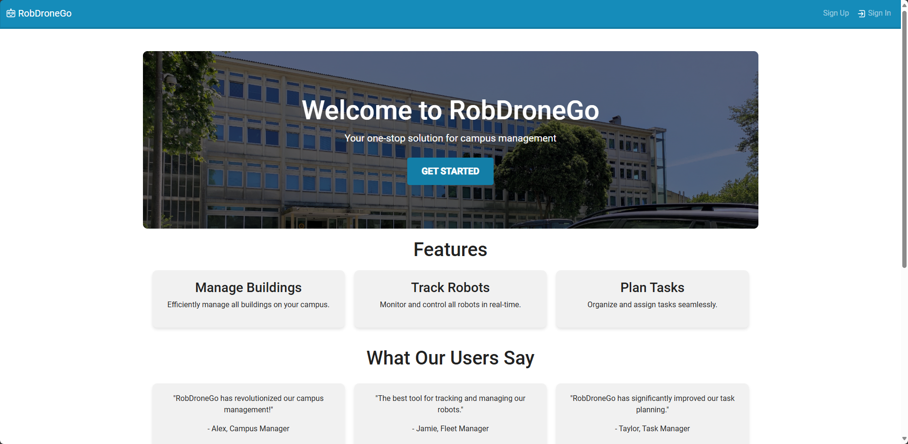
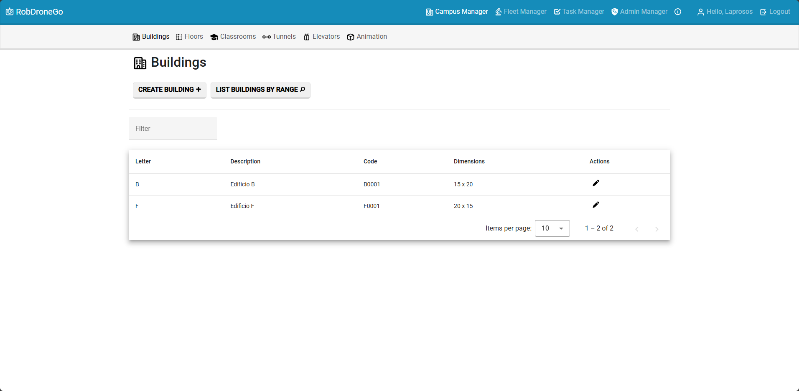
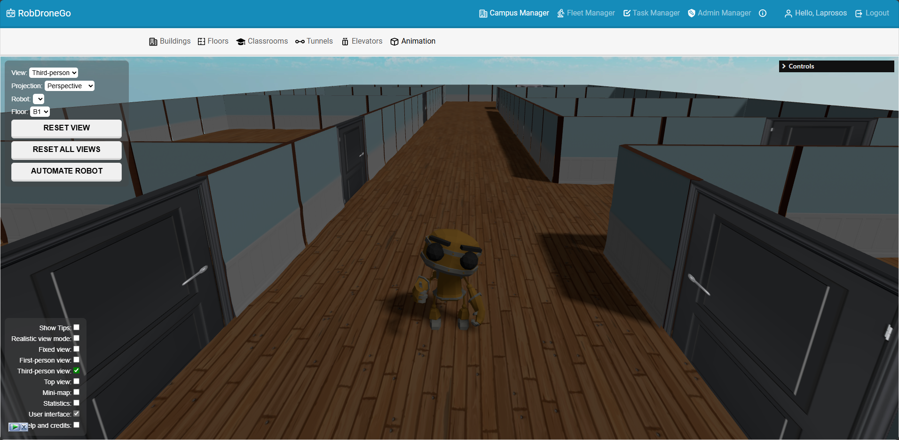

# RobDroneGo

**RobDroneGo** is a prototype system designed to manage a fleet of robots and drones that execute tasks on the ISEP campus. This project was developed as part of the "LAPR5" course within the "SEM5PI" program, which integrates all courses from the first semester of the 3rd year of the "Licenciatura em Engenharia Informática" at ISEP. The system enables efficient task execution, device management, and task planning.

## Table of Contents

- [Project Overview](#project-overview)
- [Features](#features)
- [System Users](#system-users)
- [Technologies Used](#technologies-used)
- [Installation](#installation)
- [Usage](#usage)
- [Screenshots](#screenshots)
- [Contributing](#contributing)
- [License](#license)

## Project Overview

RobDroneGo is a fleet management tool for robots and drones that focuses on task planning and execution within the ISEP campus. The system allows users to submit tasks, which are then evaluated and executed by robots or drones. The system is built with modular components, including device management, task request handling, and execution planning.

## Features

- **Device Management**: Manage robots and drones within the system.
- **Task Request Management**: Allows users to submit and track task requests.
- **Task Execution Planning**: The system plans and schedules task execution, including calculating paths for robots and drones to follow.
- **Path Planning**: Automatically plans optimal routes for robots and drones based on the campus layout.
- **User Management**: Different user roles for system administrators, fleet managers, campus managers, and users (students, faculty, and staff).

## System Users

- **System Administrator**: Manages users and permissions.
- **Fleet Manager**: Oversees robot and drone data, as well as task types.
- **Campus Manager**: Manages the campus layout and paths.
- **Users (Students, Faculty, Staff)**: Submit requests for tasks to be executed by the robots and drones.

## Targeted Robots and Drones

- **Robisep**: A mobile robot that can move through corridors, use elevators, and execute tasks such as surveillance, cleaning, and item delivery.
- **Droneisep**: A drone designed to move in outdoor spaces, performing tasks like deliveries, surveillance, and window cleaning.

## Task Request and Execution Flow

- **Task Requests**: Users can submit task requests (e.g., a faculty member requests the delivery of whiteboard markers to their office).
- **Task Evaluation and Scheduling**: Task requests are manually scheduled by the Task Manager, with plans to automate this process in the future.
- **Path Planning**: The system plans the most efficient path for robots and drones to execute tasks, which may involve multi-building or multi-floor navigation for robots, or outdoor flight paths for drones.

## Technologies Used

### Frontend
- **Angular** (with Angular Material)
- **TypeScript**
- **JavaScript**

### Backend
- **Node.js**
- **Express**
- **MongoDB** (for data storage)

## Installation

### Frontend Setup
1. Clone the repository:
    ```bash
    git clone https://github.com/mpoboas/sem5-pi-23-24-38.git
    ```
2. Navigate to the frontend directory:
    ```bash
    cd sem5-pi-23-24-38/frontend
    ```
3. Install the dependencies:
    ```bash
    npm install
    ```

### Backend Setup
1. Navigate to the backend directory:
    ```bash
    cd sem5-pi-23-24-38/backend
    ```
2. Install the dependencies:
    ```bash
    npm install
    ```

## Usage

### Frontend

#### Pre-requisites:
- Set the backend server URL in the `frontend/src/environments/environment.ts` file. By default, the backend server URL is `http://localhost:3000`.

1. Start the frontend server:
    ```bash
    ng serve
    ```
2. Open your browser and navigate to `http://localhost:4200`.

### Backend

#### Pre-requisites:
- A running MongoDB database is required. You can either use a local MongoDB instance or a cloud-based solution like MongoDB Atlas.
- Set the MongoDB connection URL in the `backend/config.js` file.

1. Start the backend server:
    ```bash
    npm start
    ```

## Screenshots

Here are some screenshots of the final product to give you an idea of what the system looks like:

1. **Homepage**
   

2. **Campus Manager - Buildings**
   

3. **The Robot!**
   


## Contributing

This project is done. There are a lot of features that were not fully implemented and plenty of bugs that need to be fixed. However, the project is considered finished and all that's left is to thank everyone that contributed to it 🩵:
- [Miguel Póvoas](https://github.com/mpoboas)
- [Nuno HAbel](https://github.com/NunoHAbell)
- [Guilherme Melo](https://github.com/GuilhermeMelo1211008)
- [Catarina Magalhães](https://github.com/catarinambm)
- [Miguel Alecrim](https://github.com/MiguelAlecrim)

## License

This project is licensed under absolutely nothing. Do whatever you want with it.
