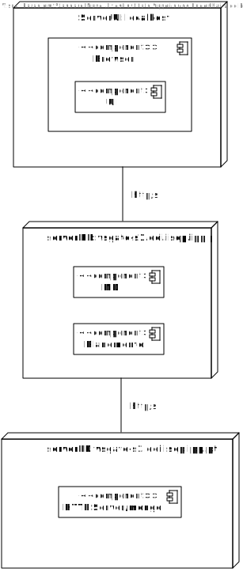

# US760 - Design

### 

# Requisitos

_____
**US760** Como arquiteto da solução pretendo um diagrama devidamente justificado e elucidativo que de que componentes existirão na solução e quais as suas interfaces de integração com indicação do tipo de informação e estrutura de informação a partilhar

### 

# Domain Model(DDD)

# Nivel 1

### Vista Logica

### Vista Senarios

# Nivel 2

### Vista Logica

### Vista Implentação

### Vista Fisica

# Nivel 3

**A implementaçao do nosso projeto utiliza a arquitetura (Onion)**

### Vista Logica

