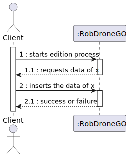
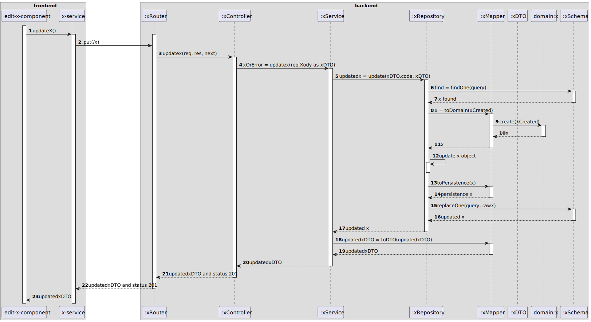

# ALL US's general process views

## Level 1
_____

### POST

### PUT

### GET

## Level 2
_____

### POST

### PUT

### GET

## Level 3
_____

### POST

### PUT

### GET

# Commentaries

#### The frontend part doesn't add much, but for some user stories (USs), the graphics don't encompass all aspects such as:

- Specifying whether the US is a dialog or not.
- Tables not representing the filter.
- In the US to inhibit robots, it doesn't have a specific component but is delivered in the GET request so that a toggle appears in the list. When this toggle is changed, it sends a PATCH request.
- In the US where an object's ID is stored, it also doesn't indicate that it will verify if it exists.
- It only displays a simple context for each US to enhance readability.
- We also don't represent the divisions that exist for each module, such as the Fleet Manager having access only to its functionalities, or the same for the campus manager and the division between each type of entity.

